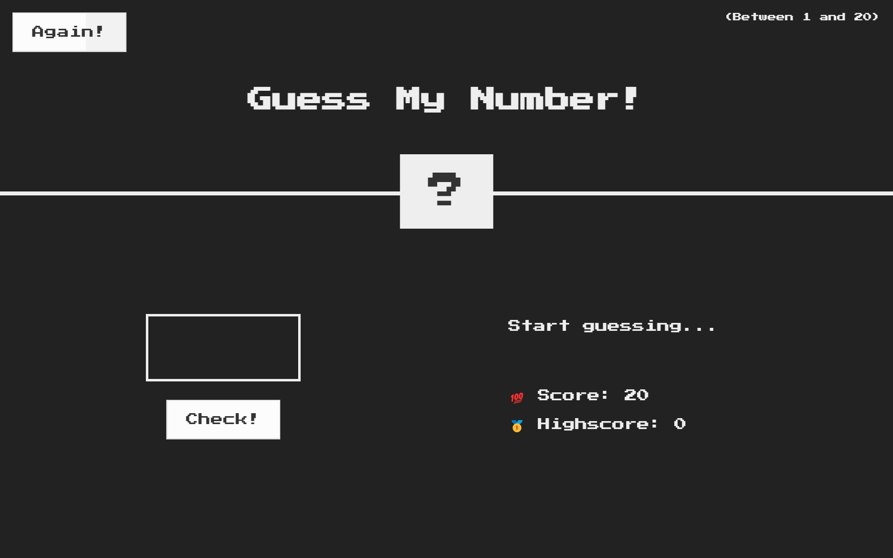

#  Guess My Number

## Table of contents

- [Overview](#overview)
  - [Screenshot](#screenshot)
  - [Links](#links)
- [My process](#my-process)
  - [What I learned](#what-i-learned)
  - [Built with](#built-with)
  - [Useful resources](#useful-resources)
- [Author](#author)

## Overview

### Screenshot

### Links

- [Live Site](https://ecemgo-guess-my-number.netlify.app/)

## My process

### What I learned

DOM is a structured representation of HTML documents. It allows JS to access HTML elements and styles to manipulate them such as changing text, HTML attributes and CSS styles. However, it is not a part of Javascript. The DOM and DOM methods are actually part of web APIs. Web APIs are like libraries that browsers implement and that we can access from our JS code.

### Built with

- Semantic HTML5 markup
- CSS custom properties
- Javascript DOM manipulation

### Useful resources

- [Udemy](https://www.udemy.com/course/the-complete-javascript-course/) - Jonas Schmedtmann's course helps how to develop the game by using Javascript DOM manipulation.
- [Codepen](https://codepen.io/jh3y/pen/QWZyxdg) - Jhey's pen called 'Background attached conic-gradient buttons 🤙' is the reference for button.

## Author

- Website - [ecemgo.com](https://www.ecemgo.com/)
- Frontend Mentor - [@ecemgo](https://www.frontendmentor.io/profile/ecemgo)
- Twitter - [@ecemgo](https://twitter.com/ecemgo)
- CodePen - [@ecemgo](https://codepen.io/ecemgo)
